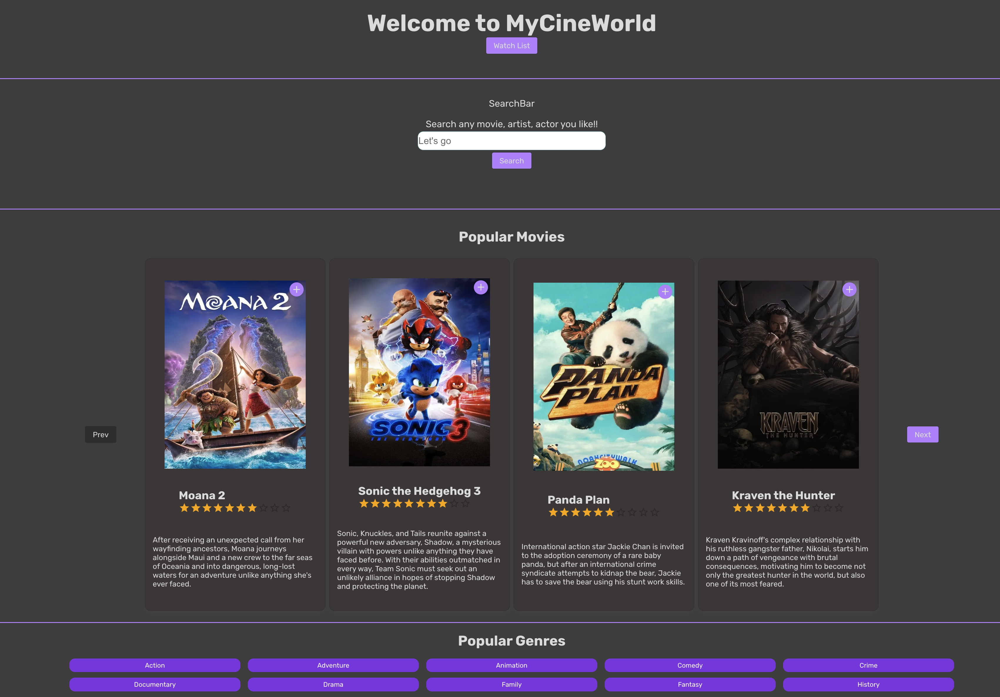
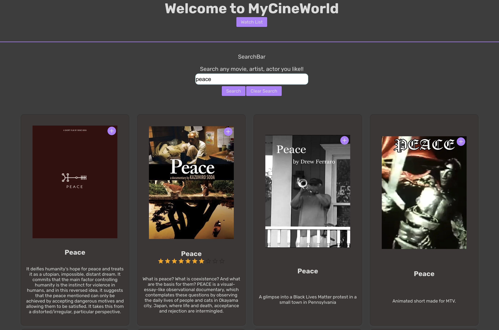

## 📽️ My-Cine-World

Welcome to **My-Cine-World** – a simple yet powerful movie exploration app built with **Next.js 15**. This fun learning project was created to explore the latest features of Next.js while building something practical and engaging.  

With **My-Cine-World**, you can:  
✅ Search for any movie out there 🎬  
✅ Browse **popular** movies currently in theaters 🍿  
✅ View **detailed** information about each movie 📝  
✅ **Save** movies to your watchlist ⭐  
✅ Enjoy a **mostly responsive** experience across devices 📱💻  

This app utilizes [TMDB's API](https://www.themoviedb.org/) to fetch movie data.

---

## 🚀 Live Demo

🔗 Check out the **live version** here:  
👉 [**My-Cine-World**](https://my-cine-world.vercel.app/)  

---

## 🛠️ Tech Stack  

- **Framework:** Next.js 15  
- **Language:** TypeScript / JavaScript  
- **Styling:** CSS / Tailwind (if used)  
- **API:** TMDB API  

---

## ⚡ Getting Started  

### 1️⃣ Clone the Repository  

```sh
git clone https://github.com/your-username/My-Cine-World.git
cd My-Cine-World
```

### 2️⃣ Install Dependencies  

```sh
npm install
```

### 3️⃣ Set Up Environment Variables  

To run the project locally, create a `.env.local` file in the root directory and add:  

```sh
ACCOUNT_ID=your_tmdb_account_id
AUTH_TOKEN=your_tmdb_auth_token
```

### 4️⃣ Start the Development Server  

```sh
npm run dev
```

For production build:  

```sh
npm run build
npm run start
```

---

## 🖼️ Screenshots  




---

## 🔥 Features & Roadmap  

✅ **Current Features:**  
- Search for movies  
- Browse popular movies in theaters  
- View detailed information on movies  
- Save movies to your watchlist  
- Mostly responsive UI  

🚀 **Upcoming Features:**  
- User activity logs 📊  
- Analytics & insights 📈  
- Discover movies by genre 🎭  
- Remove movies from watchlist ❌  
- Local storage for personalized watchlists 💾  
- A navigation bar for better UX 🧭  

---

## 🎉 Why I Built This  

This was a **fun learning project** to dive deeper into **Next.js 15** and explore its latest features. Through this project, I got hands-on experience with:  
✅ Server Components & Client Components  
✅ API calls & authentication handling  
✅ Optimizing performance in Next.js  
✅ Working with TMDB's API  

More updates are coming soon! Stay tuned! 🚀  

---

## 🤝 Contributing  

Feel free to **fork** the repository, submit issues, or suggest enhancements! Any contributions are welcome.  

---

## 📜 License  

This project is licensed under the **MIT License**.  

---

Let me know if you'd like any tweaks or additional details! 🚀